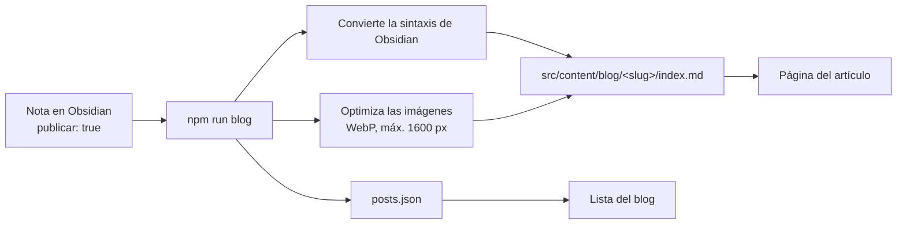
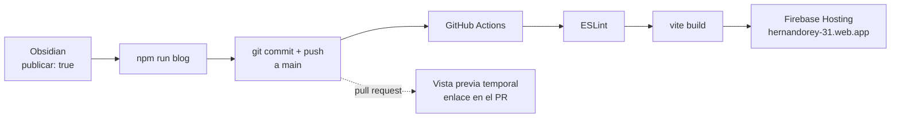

# Hernando Rey · Portafolio y blog

[](https://github.com/hrking31/hernandorey/actions/workflows/deploy.yml)

Mi sitio personal: portafolio de proyectos, CV y un blog que escribo en **Obsidian** y publico con un script propio, sin CMS.

**🌐 En vivo:** [hernandorey-31.web.app](https://hernandorey-31.web.app/)

> Desarrollador Full Stack · Ingeniero electrónico · React, Node.js y Firebase · IoT con ESP32

---

## Qué hay dentro

- **Portafolio** con proyectos destacados, filtros por categoría y enlaces a demo, código y artículos relacionados.
- **Blog sin CMS:** los artículos se escriben en Obsidian y `npm run blog` los convierte a páginas web.
- **Panel de administración** con Firebase Auth para editar proyectos, subir capturas y logos, y actualizar el CV sin tocar código.
- **CV imprimible:** la página *Hola* tiene estilos de impresión propios.
- **PWA** instalable, modo claro y oscuro (respeta la preferencia del sistema) y diseño adaptable.
- **Vista previa al compartir** en LinkedIn y WhatsApp (Open Graph).
- **Animaciones al hacer scroll** sin librerías: IntersectionObserver, View Transitions y CSS, respetando *reducir movimiento*.
- **Despliegue continuo:** cada push a `main` se revisa, compila y publica solo con GitHub Actions; cada pull request recibe su propia vista previa.

## Tecnologías

| Área | Herramientas |
|---|---|
| Frontend | React 18, React Router 7, Vite 6, Tailwind CSS 4 |
| Backend como servicio | Firebase: Firestore, Auth, Storage y Hosting |
| Blog | Obsidian, Markdown, react-markdown, remark-gfm, highlight.js |
| Herramientas | Node.js (script de publicación), sharp (optimización de imágenes), vite-plugin-pwa, ESLint |
| CI/CD | GitHub Actions, Firebase Hosting (producción y canales de vista previa) |

## Blog: de Obsidian a la web

Escribo en Obsidian, en el celular o en el PC (sincronizados con Syncthing). Cuando una nota está lista, le agrego `publicar: true` y ejecuto `npm run blog`:



El script ([`scripts/sync-blog.mjs`](scripts/sync-blog.mjs)) resuelve lo que un lector de Markdown estándar no entiende:

| Sintaxis de Obsidian | Resultado en la web |
|---|---|
| `![[foto.jpg]]` | Imagen normal, optimizada a WebP |
| `![[diagrama.canvas]]` | Su exportación como imagen |
| `[[Otra nota\|alias]]` | Texto plano |
| `> [!tip] Título` | Recuadro de color con título ([`remarkCallouts.js`](src/utils/remarkCallouts.js)) |

La bóveda solo se **lee**: el script nunca escribe en ella, y solo se publican las notas marcadas.

### Que el blog no pese aunque crezca

Cada artículo se compila en su propio archivo (`articulo-[hash].js`) y se descarga solo al abrirlo. La PWA **no los precarga**: los guarda en caché recién cuando alguien los lee, igual que las imágenes. Así la app pesa lo mismo con 2 artículos que con 500 (ver `workbox` en [`vite.config.js`](vite.config.js)).

## Publicación: de la nota al sitio en vivo

Publicar un artículo no requiere desplegar a mano: basta con subir los cambios a GitHub.



El flujo está en [`.github/workflows/deploy.yml`](.github/workflows/deploy.yml):

| Evento | Qué pasa |
|---|---|
| Push a `main` | Lint → build → publicación en el sitio real |
| Pull request a `main` | Lint → build → canal de vista previa de Firebase, con el enlace comentado en el PR |
| Dos push seguidos | El segundo cancela al primero, para no publicar una versión vieja |

Corregir o retirar un artículo es igual: se edita (o se quita `publicar: true`) en Obsidian, `npm run blog` y push.

## Estructura

```
.github/workflows/deploy.yml Lint, build y despliegue en Firebase Hosting
scripts/sync-blog.mjs        Publicación de artículos desde Obsidian
src/
  Components/
    Admin/                   Panel: proyectos, imágenes, CV, avisos
    Projects/                Tarjetas y sección pública de proyectos
    Layout/                  Piezas de maquetación compartidas
  content/blog/              Artículos generados (no se editan a mano)
  hooks/                     useAuthUser, useCvUrl, useScrollReveal
  utils/                     remarkCallouts, inclinación de tarjetas, listas, rutas de Storage
  Views/                     Inicio, Hola, Blog, Artículo, Login, Panel
```

El panel, el login y el procesador de Markdown se cargan con `React.lazy`, así los visitantes solo descargan lo que ven.

## Cómo ejecutarlo

Requisitos: **Node.js 20.12 o superior** y un proyecto de Firebase.

```bash
git clone https://github.com/hrking31/hernandorey.git
cd hernandorey
npm install
cp .env.example .env.local   # y completa los valores
npm run dev
```

| Comando | Qué hace |
|---|---|
| `npm run dev` | Servidor de desarrollo |
| `npm run blog` | Trae de Obsidian las notas con `publicar: true` |
| `npm run build` | Compila para producción en `dist/` |
| `npm run preview` | Sirve la versión compilada |
| `npm run lint` | Revisa el código con ESLint |

Despliegue: automático con GitHub Actions al hacer push a `main` (ver [Publicación](#publicación-de-la-nota-al-sitio-en-vivo)). A mano sigue funcionando `npm run build && firebase deploy`.

### Configurar el despliegue automático (una sola vez)

En el repositorio de GitHub, *Settings → Secrets and variables → Actions*, se crean estos secretos:

| Secreto | Valor |
|---|---|
| `FIREBASE_SERVICE_ACCOUNT` | El JSON de una cuenta de servicio con el rol *Firebase Hosting Admin* (Consola de Firebase → Configuración del proyecto → Cuentas de servicio) |
| `VITE_FIREBASE_API_KEY` … `VITE_FIREBASE_APP_ID` | Los mismos seis valores de `.env.local` |

### Variables de entorno

Ver [`.env.example`](.env.example). La configuración web de Firebase no es secreta: la seguridad la dan las **reglas de Firestore y Storage**, que solo permiten escribir al usuario administrador.

## Contacto

- LinkedIn: [linkedin.com/in/hernandorey](https://www.linkedin.com/in/hernandorey/)
- GitHub: [github.com/hrking31](https://github.com/hrking31)
- Correo: hrking31@gmail.com
