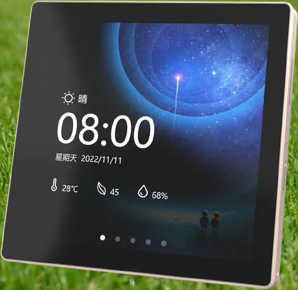

El cuarto de mis hijas tiene un ventilador de pared. Lo convertí en inteligente metiéndole unos relés y conectándolo a Home Assistant, y funcionó perfecto: desde el teléfono podía encenderlo, apagarlo y cambiarle la velocidad.

El problema apareció después, y no era técnico. **Ellas tienen cinco y seis años, y no tienen teléfono.**

Al automatizar el ventilador le había quitado los botones. Para mí era una mejora; para las dos personas que de verdad usan ese ventilador todos los días, era un aparato que había dejado de obedecerles. Cada vez que tenían calor, tenían que ir a buscar a un adulto.

Eso es un fallo de diseño, no una anécdota. Y es más común de lo que parece: se automatiza un aparato pensando en quien lo configura, no en quien lo usa.

Este es el registro de cómo se lo devolví: un panel táctil de 480 × 480 en la pared, con ESPHome y LVGL, que además acabó controlando media casa. Incluyo los tropiezos, que como siempre fueron la mitad del trabajo.

> [!abstract] En resumen
> - **El problema:** automatizar el ventilador del cuarto lo dejó sin botones, y sus usuarias tienen 5 y 6 años
> - **La alternativa descartada:** interruptores Zigbee de cuatro botones, uno por velocidad
> - **La solución:** un panel táctil de 480 × 480 con `ESP32-S3`, 16 MB de flash y 8 MB de PSRAM
> - **El software:** ESPHome con LVGL — ocho páginas, sin escribir una línea de C++ para la interfaz
> - **El resultado:** ventilador, luces, colores, reloj y temperatura, a un toque. Y les encantó
> - **Lo que más costó:** una variable de entorno heredada que impedía compilar, y un `light.turn_off` de más

---

## 🤔 Por qué una pantalla y no un interruptor

Lo primero que busqué fueron **interruptores Zigbee de cuatro botones**, uno por velocidad. Es la solución obvia, es barata y no requiere programar nada.

La descarté por cómo funciona la cabeza de un niño de cinco años.

Un interruptor de cuatro botones idénticos exige recordar **qué hace cada uno**. No hay nada en el aparato que lo diga: el botón de arriba a la izquierda es la velocidad baja porque alguien lo decidió y hay que memorizarlo. Para un adulto es trivial; para alguien que todavía está aprendiendo a leer, es un examen cada vez.

Una pantalla no exige memoria: **muestra**. Un icono de ventilador girando, la velocidad marcada en verde, el botón que ocupa media pantalla. La información está ahí, visible, y no hay que recordar nada.

Hubo un segundo motivo, más práctico: el ventilador tiene tres velocidades, oscilación y temporizador. Con cuatro botones te quedas corto enseguida. Con una pantalla, añadir una función es editar un archivo.

> [!tip] La regla que saqué de esto
> **Si el usuario no puede leer el manual, el aparato tiene que ser el manual.**

---

## 🛒 Elegir la pantalla antes de comprarla

Cuando me puse a buscar una pantalla me topé con muchísimas: de todos los tamaños, casi todas con un ESP32 detrás y a precios muy parecidos. Encontrar una no era el problema; el problema era saber **cuál me iba a servir**. Y para mí servir tenía un significado concreto: que funcionara con **ESPHome**. No quería comprar una placa y descubrir, con ella ya en la mano, que no había forma de hacerla andar.

Pronto entendí que el anuncio de la tienda dice muy poco. Lo que decide si una pantalla se puede usar son cuatro datos:

- **El chip que gestiona la pantalla**, que ESPHome tiene que saber controlar.
- **El chip que gestiona la parte táctil**, si la tiene.
- **Los pines** con los que esos dos chips se conectan al ESP32.
- **El modelo de ESP32** que lleva la placa.

Averiguarlos no es sencillo. Los vendedores casi nunca los publican completos, así que toca investigar, y puede ser una tarea bastante compleja.

Lo que me desbloqueó fue este repositorio: [platformio-espressif32-sunton](https://github.com/rzeldent/platformio-espressif32-sunton). Documenta muchas de las pantallas baratas del mercado —entre ellas las famosas amarillas, las CYD (*Cheap Yellow Display*)— con justo esos datos de cada modelo. Con esa ficha delante ya podía comprobar, **antes de pagar**, si ESPHome tenía soporte para cada pieza.

Después de comparar, esta fue la elegida:



> [!tip] Antes de comprar, busca la ficha
> Si no puedes nombrar los dos chips, los pines y el ESP32 de una pantalla, todavía no sabes si la vas a poder usar. Busca primero su modelo; si no aparece documentado en ningún sitio, piénsalo dos veces.

---

## 🔍 Lo que hay dentro

Estos paneles se venden montados y son una ganga por lo que traen. El mío lleva:

| Componente | Qué es |
|---|---|
| `ESP32-S3` | El cerebro: doble núcleo a 240 MHz, WiFi y Bluetooth |
| 16 MB de flash | Espacio para el firmware. LVGL ocupa lo suyo |
| **8 MB de PSRAM octal** | La clave de todo. Sin esto no hay gráficos |
| `ST7701S` | El controlador del display, por RGB paralelo |
| `GT911` | El táctil capacitivo, por I2C |
| `CH340` | El conversor USB-serie para programarlo por cable |

La PSRAM merece un párrafo. Una pantalla de 480 × 480 en color de 16 bits necesita **450 KB por cada búfer** de imagen. El ESP32-S3 tiene 320 KB de RAM interna en total: no cabe ni uno. Por eso estos paneles llevan PSRAM externa, y por eso un módulo sin ella no sirve para esto por muy potente que sea.

### Los pines, que aquí son muchos

El display no va por SPI como las pantallitas pequeñas: va por **RGB paralelo**, que significa un pin por cada bit de color. Dieciséis líneas de datos más las de sincronismo.

```yaml
display:
  - platform: st7701s
    dimensions:
      width: 480
      height: 480
    de_pin: 18
    hsync_pin: 16
    vsync_pin: 17
    pclk_pin: 21
    pclk_frequency: 12MHz
    data_pins:
      red:   [11, 12, 13, 14, 0]
      green: [8, 20, 3, 46, 9, 10]
      blue:  [4, 5, 6, 7, 15]
```

Seis bits para el verde y cinco para rojo y azul: es el formato **RGB565**, el estándar en estos controladores. El ojo humano distingue más matices de verde, así que se le da el bit extra.

Además del bus paralelo hace falta **SPI**, pero solo para la secuencia de encendido: el `ST7701S` necesita recibir unos comandos de configuración al arrancar, y después ya solo escucha el bus de datos.

> [!info] Un detalle que confunde al principio
> `update_interval: never` en el display no es un error. Con LVGL, quien decide cuándo repintar es la biblioteca gráfica, no ESPHome. Si pones un intervalo, estarás repintando la pantalla entera sin motivo.

---

## ⚡ Verificar la placa antes de escribir una línea

Esta lección la aprendí a base de perder tiempo en otro proyecto: **declarar una placa que no es la que tienes se paga caro**. En un Wemos D1 Mini llegué a tener configurado el modelo *Lite*, que tiene 1 MB de flash en vez de 4. El firmware compilaba, cargaba, y luego fallaba de formas incomprensibles.

Se comprueba en un segundo, con la placa conectada por USB:

```
esptool --port COM10 flash-id
```

Y responde con la verdad:

```
Chip type:          ESP32-S3 (QFN56) (revision v0.2)
Features:           Wi-Fi, BT 5 (LE), Dual Core, 240MHz, Embedded PSRAM 8MB
Detected flash size: 16MB
```

Ahí está todo: 16 MB de flash y 8 MB de PSRAM embebida. Eso corresponde a la variante **N16R8**, y confirma que la declaración es correcta:

```yaml
esp32:
  board: esp32-s3-devkitc-1
  variant: esp32s3
  flash_size: 16MB

psram:
  mode: octal
  speed: 80MHz
```

> [!warning] Octal contra quad
> El `mode: octal` de la PSRAM no es decorativo. Los ESP32-S3 con 8 MB usan interfaz octal; los de 2 MB, quad. **Si te equivocas, el chip no arranca** — ni siquiera llega a encender el display. Y en la salida de `esptool` aparece un `Flash type set in eFuse: quad` que se refiere a la **flash**, no a la PSRAM: son dos buses distintos y es fácil confundirse.

---

## ⚙️ Por qué ESP-IDF y no Arduino

ESPHome puede compilar con Arduino o con ESP-IDF. Para esto, **ESP-IDF no es opcional**: el soporte de PSRAM octal y de displays RGB paralelo vive ahí.

```yaml
framework:
  type: esp-idf
  sdkconfig_options:
    COMPILER_OPTIMIZATION_SIZE: y
    CONFIG_ESP32S3_DEFAULT_CPU_FREQ_240: "y"
    CONFIG_ESP32S3_DATA_CACHE_64KB: "y"
    CONFIG_ESP32S3_DATA_CACHE_LINE_64B: "y"
    CONFIG_SPIRAM_FETCH_INSTRUCTIONS: y
    CONFIG_SPIRAM_RODATA: y
```

Las dos últimas líneas son las que más se notan: mueven instrucciones y datos de solo lectura a la PSRAM, liberando la RAM interna para lo que de verdad la necesita. Las de caché aceleran los accesos a esa memoria externa, que es bastante más lenta que la interna.

---

## 🎨 Ocho páginas sin escribir C++

La interfaz son **ocho páginas** declaradas en YAML. LVGL es una biblioteca de C, pero ESPHome la envuelve entera: se describen los widgets y él genera el código.

| Página | Para qué |
|---|---|
| Portada | Un botón enorme para la luz principal. Lo que se ve el 90% del tiempo |
| Menú | Rejilla de iconos hacia el resto |
| Ventilador | Cuatro velocidades |
| Luces | Pasillo, baño, sala de juegos |
| Lámpara | Brillo con deslizador |
| Colores | Nueve círculos de colores |
| Reloj | Hora, día y fecha en grande |
| Temperatura | La lectura del sensor del cuarto |

La portada es deliberadamente simple: **un botón de 470 × 424 píxeles**. Casi la pantalla entera para una sola función.

Eso no es pereza de diseño. Un niño de cinco años no apunta con precisión: da un manotazo en la dirección aproximada de lo que quiere. Un botón que ocupa el 90% de la superficie perdona cualquier manotazo. Uno de 60 × 60 píxeles, no.

### La capa que está siempre encima

LVGL tiene un concepto muy útil llamado `top_layer`: widgets que flotan sobre todas las páginas.

```yaml
top_layer:
  widgets:
    - label:
        id: lbl_hastatus
        text: "\U000F05A9"    # icono de WiFi
        hidden: true
        align: top_right
    - label:
        id: display_time
        text: "00:00 am"
        align: top_right
```

Ahí viven la hora y el icono de conexión. El icono aparece y desaparece solo, enganchado a los eventos de la API:

```yaml
api:
  on_client_connected:
    - if:
        condition:
          lambda: 'return (0 == client_info.find("Home Assistant "));'
        then:
          - lvgl.widget.show: lbl_hastatus
```

De un vistazo sabes si el panel está hablando con Home Assistant o se quedó solo.

---

## 🏠 Cómo se entera de lo que pasa en la casa

Un panel que solo manda órdenes miente. Si enciendes la luz del pasillo desde el teléfono, el botón de la pantalla tiene que enterarse.

ESPHome lo resuelve con sensores que **leen** el estado de Home Assistant:

```yaml
binary_sensor:
  - platform: homeassistant
    id: pasillo_luz
    entity_id: light.luz_pasillo
    trigger_on_initial_state: true
    on_state:
      then:
        - if:
            condition:
              lambda: return id(pasillo_luz).state;
            then:
              - lvgl.widget.update:
                  id: luz_pasillo_boton
                  text_color: 0x00FF00
            else:
              - lvgl.widget.update:
                  id: luz_pasillo_boton
                  text_color: 0xFF0000
```

Verde encendida, rojo apagada. El `trigger_on_initial_state` es importante: sin él, el botón no sabe de qué color pintarse hasta que alguien toque algo.

Y en el otro sentido, para mandar órdenes:

```yaml
on_click:
  - homeassistant.action:
      action: light.toggle
      data:
        entity_id: light.luz_pasillo
```

> [!tip] `action`, no `service`
> Si sigues tutoriales de hace un par de años verás `homeassistant.service:` con una clave `service:` dentro. Sigue funcionando, pero está **deprecado**: ahora es `homeassistant.action:` con `action:`. Home Assistant renombró los "servicios" a "acciones" y ESPHome fue detrás.

---

## 🕐 La hora y la fecha en español

ESPHome no trae los nombres de los días y meses en español. Se resuelven con un lambda y dos tablas:

```yaml
- lvgl.label.update:
    id: day_label
    text: !lambda |-
      static const char * const day_names[] = {
        "DOMINGO", "LUNES", "MARTES", "MIERCOLES",
        "JUEVES", "VIERNES", "SABADO"};
      return day_names[id(time_comp).now().day_of_week - 1];
```

El `- 1` es obligatorio: `day_of_week` empieza en 1, los arrays de C en 0. Sin él, el domingo se convierte en lunes y todo se corre un día.

La hora en formato de 12 horas tiene su propia trampa:

```cpp
int hour_12 = now.hour % 12;
if (hour_12 == 0) hour_12 = 12;   // medianoche y mediodía
```

Sin esa línea, las 12 del mediodía se muestran como las 0:00.

---

## 🌙 Que la pantalla sobreviva a los años

Un panel encendido las veinticuatro horas con la misma imagen acaba con esa imagen grabada. Hay tres mecanismos trabajando juntos:

**Se apaga sola.** Tras unos segundos sin tocarla, se apaga la retroiluminación y LVGL se pausa:

```yaml
lvgl:
  on_idle:
    timeout: !lambda "return (id(display_timeout).state * 1000);"
    then:
      - light.turn_off: back_light
      - switch.turn_on: switch_antiburn
      - lvgl.pause:
```

El tiempo no está fijo en el código: sale de un `number` configurable desde Home Assistant, de 10 a 180 segundos.

**Vuelve a la portada.** Si nadie la toca, regresa a la página inicial, para que al despertar siempre muestre lo mismo.

**Modo antiquemado.** Mientras está pausada, LVGL puede dibujar ruido en movimiento:

```yaml
- lvgl.pause:
    show_snow: true
```

Píxeles aleatorios que evitan que ninguna zona se quede fija. Es feo, pero está apagada y nadie lo ve.

---

## 🐛 Los tropiezos

La parte que suele faltar en los tutoriales.

### El apagado que en realidad apagaba

Quería que la pantalla brillara al 100% de día y al 40% de noche. Escribí esto:

```yaml
- hours: 18
  minutes: 0
  then:
    - light.turn_on:
        id: back_light
        brightness: 40%
    - light.turn_off: back_light     # ← esta línea
```

Y funcionó exactamente como está escrito: encendía al 40% y **apagaba a continuación**. Todas las tardes, a las seis, la pantalla se apagaba sola.

Lo que lo hace difícil de ver es que el bloque parece razonable de un vistazo. El error solo aparece si te preguntas qué hace la última línea, y llevaba meses ahí.

> [!warning] Los errores de horario no se notan
> Un fallo en el arranque salta a la primera. Un fallo programado a las 18:00 se manifiesta una vez al día, cuando probablemente no estás mirando, y es fácil atribuirlo a otra cosa.

### La fuente que estaba un piso más arriba

```yaml
- file: "fonts/materialdesignicons-webfont.ttf"
```

La carpeta `fonts/` estaba en la raíz del repositorio, pero el YAML vive en un subdirectorio, y **ESPHome resuelve las rutas relativas al archivo de configuración**, no al sitio desde donde lanzas el comando. Había que subir un nivel:

```yaml
- file: "../fonts/materialdesignicons-webfont.ttf"
```

### Dos temporizadores que no se hablaban

Había dos cuentas atrás independientes: una devolvía a la portada a los **40 segundos**, valor fijo en el código; otra apagaba la pantalla usando el número configurable, que por defecto era 45.

Mientras nadie tocara la configuración, el orden funcionaba. Pero bastaba bajar el apagado a 30 segundos para invertirlo: la pantalla se apagaba **antes** de volver a la portada, y al despertar aparecía en una página cualquiera.

La solución es que uno derive del otro:

```yaml
- if:
    condition:
      lambda: 'return id(inactivity_timer) >= (id(display_timeout).state - 5);'
```

Siempre cinco segundos antes, sea cual sea el valor. Y de paso, que solo cuente si LVGL no está en pausa: no tiene sentido recargar páginas que nadie está viendo.

### El que costó la tarde entera: una variable de entorno

Este merece la sección más larga, porque el mensaje de error apuntaba a cualquier sitio menos al culpable.

La compilación fallaba siempre en el mismo punto, después de compilarlo todo:

```
ModuleNotFoundError: No module named 'esptool'
*** [.pioenvs/espantalla/bootloader.bin] Error 1
```

Lo primero que pensé es que la descarga se había cortado. Y algo de eso había: la carpeta de la herramienta existía pero **solo con los archivos de metadatos**, sin el programa. La borré para que se descargara de nuevo. Falló igual.

Rebuscando en el registro completo apareció la línea que lo explicaba todo, sepultada entre cientos:

```
ERROR: MSys/Mingw is not supported. Please follow the getting started guide
```

Estaba lanzando ESPHome desde **Git Bash**, y el instalador de herramientas de ESP-IDF se niega explícitamente a funcionar en ese entorno. Cambié a PowerShell. **Y siguió fallando igual.**

La razón es sutil y es la lección de verdad: PowerShell heredaba las variables de entorno del proceso que lo lanzaba, y entre ellas viajaba `MSYSTEM=MINGW64`. El instalador no comprueba qué intérprete lo ejecuta — **comprueba si esa variable existe**. Daba igual desde dónde lo llamara: la marca de Git Bash iba dentro del entorno.

```powershell
Remove-Item Env:MSYSTEM
esphome compile pantalla-esp32.yaml
```

Compiló a la primera, en veintiséis segundos.

> [!danger] El fallo que se disfrazó de éxito
> Hubo un detalle que alargó el diagnóstico más de lo necesario. La primera compilación la lancé así:
>
> ```
> esphome compile pantalla-esp32.yaml | tail -40
> ```
>
> Y el sistema informó de **éxito**. En una tubería, el código de salida es el del **último** comando: el de `tail`, que siempre triunfa. El fallo de ESPHome quedaba enmascarado.
>
> Si automatizas compilaciones, no pongas nada después de una tubería cuando te importe el resultado, o usa `set -o pipefail`.

---

## ✅ Decisiones que valió la pena tomar

**Los estilos compartidos.** Definir `header_footer` una vez y aplicarlo a todas las cabeceras evita nueve copias de los mismos ocho parámetros.

```yaml
style_definitions:
  - id: header_footer
    bg_color: 0x8A2BE2
    bg_grad_color: 0xE6E6FA
    bg_grad_dir: VER
    width: 100%
    height: 40
```

**Elegir los iconos a mano.** La fuente Material Design Icons trae más de siete mil glifos. Compilarlos todos hincharía el firmware sin sentido, así que se declara la lista concreta:

```yaml
- file: "../fonts/materialdesignicons-webfont.ttf"
  id: light48
  size: 48
  glyphs: ["\U000F0335", "\U000F0210", "\U000F0150"]
```

El precio de esta decisión es que **un icono que no esté en la lista no se dibuja**: aparece un hueco. Hay que acordarse de añadirlo al usarlo.

**Un `number` para el tiempo de apagado.** Poder ajustarlo desde Home Assistant, sin recompilar, ha resultado más útil de lo que parecía.

**No sobrecargar la interfaz.** Probé añadir una página de demostración con arcos, barras, LED, un indicador giratorio y un código QR. Todo funcionaba y quedaba vistoso, pero **no aportaba nada**: eran adornos compitiendo por la atención en una pantalla cuyas usuarias principales tienen cinco y seis años.

Los quité todos. Cuando el criterio es "¿esto ayuda a una niña a encender su ventilador?", la mitad de las ideas se caen solas.

Un widget que no responde una pregunta que alguien se hace de verdad es ruido.

**Quitar lo que nunca se usó.** Había montado una sección con el horario de clases: seis páginas, una por día. Nunca llegué a rellenarlas, y ahí siguieron meses ocupando un botón del menú. Las borré.

Una función a medias no es una promesa de futuro: es un botón que decepciona a quien lo pulsa.

---

## 🎯 El resultado

El firmware final ocupa poco para lo que hace:

| Recurso | Uso |
|---|---|
| RAM interna | 12,6% — 41 KB de 320 KB |
| Flash de aplicación | 20,7% — 1,69 MB de 8,13 MB |

Queda margen de sobra. La PSRAM, que es donde vive el búfer gráfico, ni se inmuta.

Y lo que importa no se mide en kilobytes: **el ventilador volvió a ser de ellas**. Lo encienden solas, le cambian la velocidad solas y ya no tienen que ir a buscar a nadie cuando tienen calor.

Les encantó, que era el único indicador que importaba. El resto —que sea local, que responda en milisegundos, que se actualice por WiFi sin desmontarlo y que no le pregunte nada a ningún servidor a diez mil kilómetros— es lo que me llevo yo.

---

## 🧭 Si vas a intentarlo

1. **Comprueba el chip con `esptool flash-id` antes de nada.** Treinta segundos que te ahorran una tarde de fallos incomprensibles.
2. **Asegúrate de que el módulo tiene PSRAM** y de declarar bien si es octal o quad. Sin ella no hay pantalla; mal declarada, no hay arranque.
3. **Usa el framework ESP-IDF.** Para RGB paralelo y PSRAM octal, Arduino no llega.
4. **Empieza por una sola página** y comprueba que se dibuja. Depurar una interfaz de ocho páginas que no aparece es desesperante.
5. **Declara solo los iconos que uses**, y recuerda añadirlos a la lista cuando metas uno nuevo.
6. **Enlaza los estados en los dos sentidos** desde el principio. Un panel que no refleja lo que pasa fuera de él genera desconfianza y se deja de usar.
7. **Si la compilación falla de forma absurda, lee el registro entero.** El error real suele estar cientos de líneas antes del que te muestran.

Y sobre todo: cuando algo falle y el mensaje no tenga sentido, sospecha del entorno antes que del código. Mi configuración era válida desde el primer intento; lo que estaba roto era el sitio desde donde la lanzaba.
